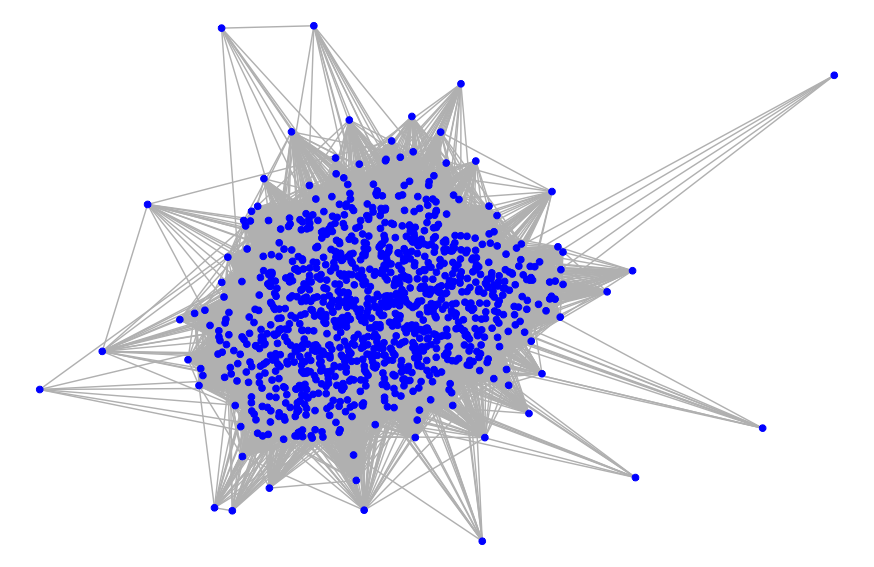

```{r setup, include=FALSE}
options(htmltools.dir.version = FALSE)
```


```{r xaringan-themer, include=FALSE}
library(xaringanthemer)
style_duo_accent(
  # primary_color = "#345865",
  primary_color = "#4B5263",
  secondary_color = "#2c90a6",
  black_color = "#4242424",
  white_color = "#FFF",
  base_font_size = "25px",
  text_font_family = "Roboto Slab",
  text_font_url = "https://indestructibletype.com/fonts/Jost.css",
  header_font_google = google_font("Roboto Slab", "400", "700"),
  header_font_weight = "400",
  inverse_header_color = "#eaeaea",
  title_slide_text_color = "#FFFFFF",
  text_slide_number_color = "#9a9a9a",
  text_bold_color = "#f79334",
  code_inline_color = "#B56B6F",
  link_color = "#2c8475",
  table_row_even_background_color = lighten_color("#345865", 0.9),
  extra_fonts = list(
    "https://indestructibletype.com/fonts/Jost.css",
    google_font("Amatic SC", "400")
  ),
  colors = c(
    green = "#31b09e",
    "green-dark" = "#2c8475",
    highlight = "#87f9bb",
    purple = "#887ba3",
    pink = "#B56B6F",
    orange = "#f79334",
    red = "#dc322f",
    `blue-dark` = "#002b36",
    `text-dark` = "#202020",
    `text-darkish` = "#424242",
    `text-mild` = "#606060",
    `text-light` = "#9a9a9a",
    `text-lightest` = "#eaeaea"
  ),
  extra_css = list(
    ".remark-slide-content h3" = list(
      "margin-bottom" = 0, 
      "margin-top" = 0
    ),
    ".smallish, .smallish .remark-code-line" = list(`font-size` = "0.9em")
  )
)
xaringanExtra::use_xaringan_extra("animate_css")
```

```{r metadata, echo=FALSE}
library(metathis)
meta() %>% 
  meta_description("Presented at Academy of Management Conference, Seattle 2022") %>% 
  meta_social(
    title = "Network Analysis in Organizational Design",
    url = "https://aom2022.keithmcnulty.org",
    image = "https://aom2022.keithmcnulty.org/cover.png",
    twitter_card_type = "summary_large_image",
    twitter_creator = "dr_keithmcnulty"
  )

```

```{r components, include=FALSE}
slides_from_images <- function(
  path,
  regexp = NULL,
  class = "hide-count",
  background_size = "contain",
  background_position = "top left"
) {
  if (isTRUE(getOption("slide_image_placeholder", FALSE))) {
    return(glue::glue("Slides to be generated from [{path}]({path})"))
  }
  if (fs::is_dir(path)) {
    imgs <- fs::dir_ls(path, regexp = regexp, type = "file", recurse = FALSE)
  } else if (all(fs::is_file(path) && fs::file_exists(path))) {
    imgs <- path
  } else {
    stop("path must be a directory or a vector of images")
  }
  imgs <- fs::path_rel(imgs, ".")
  breaks <- rep("\n---\n", length(imgs))
  breaks[length(breaks)] <- ""

  txt <- glue::glue("
  class: {class}
  background-image: url('{imgs}')
  background-size: {background_size}
  background-position: {background_position}
  {breaks}
  ")

  paste(txt, sep = "", collapse = "")
}
options("slide_image_placeholder" = FALSE)
```

class: left title-slide no-animation
background-image: url('nasa.jpg')
background-size: cover
background-position: top center

[medium-km]: https://keith-mcnulty.medium.com
[dr_km]: https://twitter.com/dr_keithmcnulty
[km]: https://www.linkedin.com/in/keith-mcnulty/

# Network Analysis in Organizational Design

.title-where[
Academy of Management Conference -  August 9, 2022
]

```{css echo=FALSE}
@keyframes title-text{
    0% {
        opacity: 0;
        text-shadow: -20px 30px 5px rgba(0,0,0,0.25);
        transform: translate(15px, -15px);
    }
    10% {
        opacity: 0;
        text-shadow: -20px 30px 5px rgba(0,0,0,0.25);
        transform: translate(15px, -15px);
    }
    80% {
        opacity: 1;
        text-shadow: -5px 5px 10px rgba(0,0,0,0.25);
        transform: translate(0, 0);
    }
    100% {
        opacity: 1;
        text-shadow: -5px 5px 10px rgba(0,0,0,0.25);
        transform: translate(0, 0);
    }
}

@keyframes enter-right {
  0% {
    opacity: 0;
    transform: rotate(90deg) translateY(-50px)
  }
  20% {
    opacity: 0;
    transform: rotate(90deg) translateY(-50px)
  }
  80% {
    opacity: 1;
    transform: rotate(90deg) translateY(0)
  }
  100% {
    opacity: 1;
    transform: rotate(90deg) translateY(0)
  }
}

@keyframes enter-left {
  0% {
    opacity: 0;
    transform: translateY(100px)
  }
  20% {
    opacity: 0;
    transform: translateY(100px)
  }
  60% {
    opacity: 1;
    transform: translateX(0)
  }
  100% {
    opacity: 1;
    transform: translateX(0)
  }
}

.title-slide h1 {
	font-size: 50px;
	font-family: Jost, sans;
	animation-name: title-text;
	animation-duration: 13s;
	animation-direction: alternate;
	animation-iteration-count: infinite;
}

.side-text {
	color: white;
  opacity: 0.66;
	transform: rotate(90deg);
	position: absolute;
  font-size: 20px;
	top: 130px;
	right: -130px;
  transition: opacity 0.5s ease-in-out;
	animation-name: enter-right;
	animation-duration: 13s;
	animation-direction: alternate;
	animation-iteration-count: infinite;
}

.side-text:hover {
  opacity: 1;
}

.side-text a {
  color: white;
}

.title-where {
	color: white;
	font-family: Jost, sans;
	font-size: 30px;
	position: relative;
	top: -30px;
	animation-name: enter-left;
	animation-duration: 13s;
	animation-direction: alternate;
	animation-iteration-count: infinite;
  animation-timing-function: ease-in-out;
}
```

```{r echo = FALSE}
xaringanExtra::use_progress_bar(
  color = "blue",
  location = c("top", "bottom"),
  height = "0.25em"
)
```

---
class: left, middle

```{r, echo = FALSE}
xaringanExtra::use_logo(
  image_url = "https://higherlogicdownload.s3.amazonaws.com/AOM/b86d0d96-0525-46fd-9622-7a21331458fa/UploadedImages/TIM/_AOMLogo-ReverseWithKnockOutType-8.png"
)

xaringanExtra::use_animate_all("fade")


```


## McKinsey & Company US, 2019

.f3[
&#127482;&#127480; Organized into five regional centers or 'complexes': Northeast, Mid-Atlantic, South, Midwest, West Coast 
]

.f3[
&#127482;&#127480; Organization had grown into this shape from the early days of the company.  Common wisdom was that it made sense.
]

.f3[
&#127482;&#127480; Question raised: *What drives collaboration between our people?*]

.f3[
&#127482;&#127480; Answer:  Other things are more important than physical location.
]

.f3[
&#127482;&#127480; Consequence:  Abolition of regional structure, integration into a single United States practice.
]

---
class: left, middle

## Analytic method

1. Created metrics of connection between 1,000+ sampled consultants
2. Created a network graph based on these measures
3. Used a community detection algorithm (the Leiden algorithm) to break the graph into distinct communities of more densely interacting groups.
4. Analyzed groups by key descriptive demographics to see how they were best described.
5. Used visualization methods to demonstrate conclusions in the most compelling way

---
class: left, middle

## The original graph

```{r, echo = FALSE, fig.align = "center", out.height = "400"}

```

---
class: left, middle

## Graph by location

```{r, echo = FALSE, fig.align = "center", out.height = "400"}

```

---
class: left, middle

## Graph by Leiden community

```{r, echo = FALSE, fig.align = "center", out.height = "400"}

```

---
class: left, middle

## Community characteristics

```{r, echo = FALSE, fig.align = "center", out.height = "400"}

```

---
class: left, middle

## Assortativity and Modularity

Assortativity is a mathematical measure of how likely two vertices are to be connected based on a shared characteristic.  Modularity is a measure of the accuracy of a community structure.

```{r, echo = FALSE}
assort <- data.frame(
  Characteristic = c("Location", "Industry", "Leiden Community"),
  Assortativity = c(0.07, 0.23, 0.29),
  Modularity = c(0.13, 0.37, 0.45)
)

knitr::kable(assort)

```

---
class: left, middle

## Compellingly illustrating community

```{r, echo = FALSE, fig.align = "center"}
knitr::include_graphics("leiden1.gif")

```


